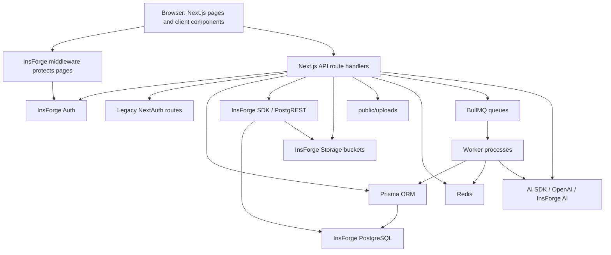
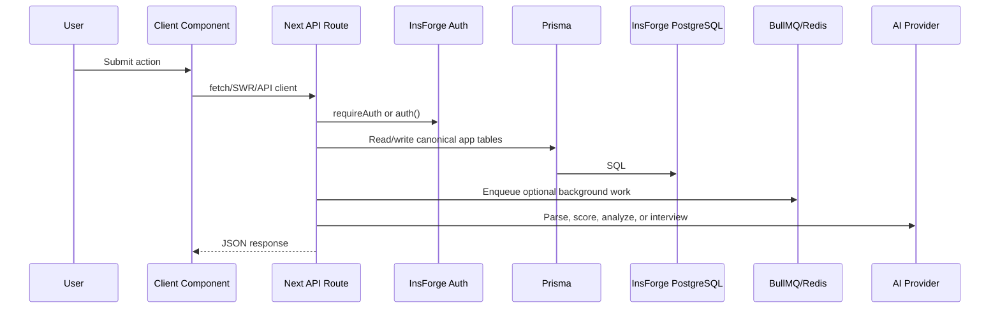
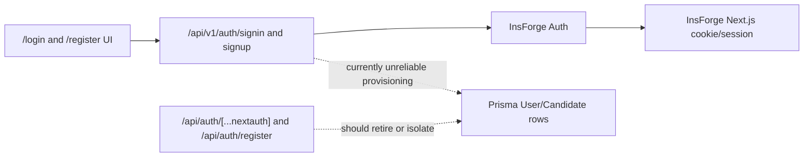
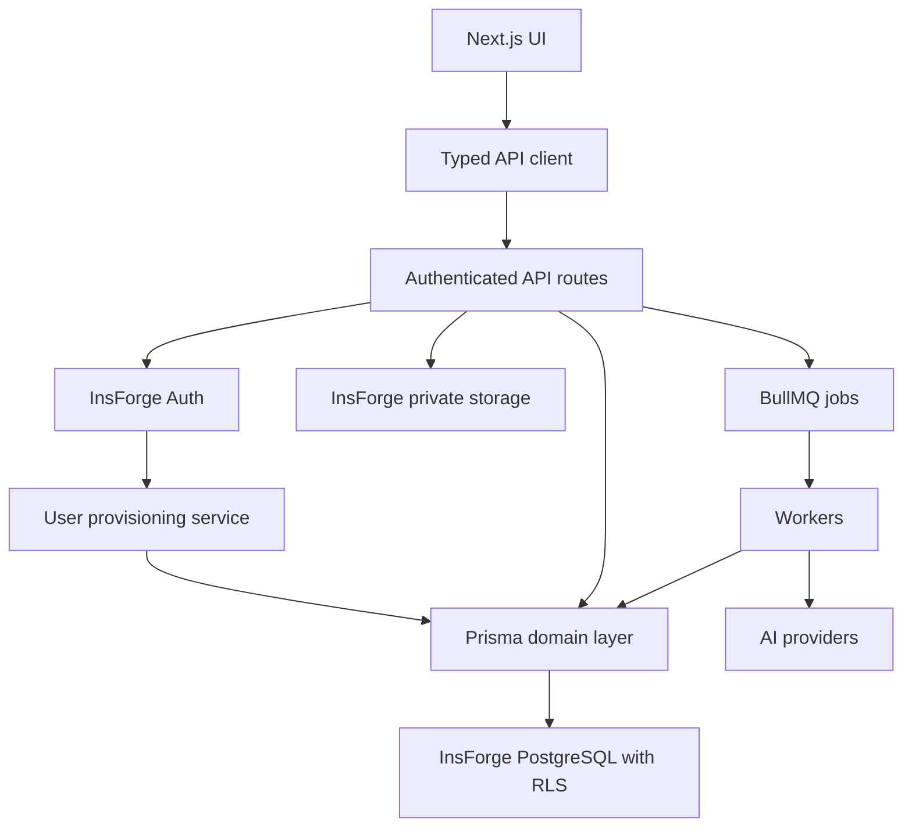

# Architecture

The application is a Next.js App Router monolith with server route handlers, Prisma data access, InsForge auth, InsForge SDK/PostgREST calls, Redis/BullMQ workers, and AI-powered services.

The central architectural issue is that the project has not finished choosing a canonical backend contract. Prisma and InsForge are both valid ways to access the same PostgreSQL backend, but the code currently mixes two schema naming conventions and two auth systems.

## High-Level System

## Route and Data Flow

## Major Architecture Decisions

| Decision Area | Current State | Risk | Recommended Decision |
| --- | --- | --- | --- |
| Auth system | InsForge auth is used by UI and middleware; NextAuth remains in code. | Duplicate sessions, duplicated user tables, unclear source of truth. | Use InsForge auth only. Keep NextAuth code only during a deliberate migration window. |
| Database access | Prisma and InsForge SDK both write application tables. | Inconsistent naming, broken endpoints, hard-to-test policies. | Use Prisma for server-owned application data and InsForge SDK for auth/storage/managed platform features. |
| Schema naming | Prisma tables are quoted CamelCase; newer InsForge feature tables are snake-case. | Route handlers silently fail when using non-existent table names. | Create one naming convention and migrate old routes. If both remain, document ownership per table. |
| API protection | Page middleware protects non-API paths; API route protection is manual. | Missing `withAuth` on one route exposes data. | Require explicit auth metadata for every route and test unauthorized access. |
| File storage | InsForge private buckets exist, but resume uploads write to `public/uploads`. | Private candidate files can become public/static deployment assets. | Store all user files in InsForge private buckets. |
| Async work | BullMQ exists, but interview feedback and analysis are fire-and-forget promises. | Lost jobs during serverless shutdown, no retry, inconsistent feedback status. | Put all slow AI/background work on queues with retry and status rows. |
| Caching | Redis cache has in-memory fallback. | Tests and local dev still attempt Redis connections; fallback may hide production config issues. | Mock Redis in tests and add cache health to deployment checks. |

## Data Model Split

The live backend contains both:

- Prisma-originated quoted CamelCase tables such as `User`, `Candidate`, `ResumeVersion`, `Application`, `Job`, `JobRecommendationScore`, `ResumeEmbedding`, and `Notification`.
- Snake-case feature tables such as `job_listings`, `job_ats_scores`, `skill_gaps`, `interview_sessions`, `interview_messages`, and `interview_feedback`.

The app also references snake-case legacy tables that do not exist live:

- `profiles`
- `resume_versions`
- `resumes`
- `parsed_resumes`
- `ats_scores`
- `resume_suggestions`
- `candidates`
- likely `jobs` when accessed through InsForge SDK as lower-case `jobs`

This is the highest-priority architecture defect. It creates a situation where two routes that appear to do the same thing can use different schemas and produce different data shapes.

## Authentication Boundary

Recommended target:

1. InsForge owns identity, sessions, OAuth, and email verification.
2. Prisma owns app-domain user profile rows.
3. A signup/login provisioning service ensures every InsForge user has a `User` and `Candidate` row.
4. API routes read the app user through a single helper, not ad hoc email lookups in every feature.

## Frontend Architecture

The frontend is organized into App Router route groups:

- `(public)` for the landing page.
- `(auth)` for login/register.
- `(dashboard)` for authenticated product pages.
- `api` for backend route handlers.

Data fetching is split among:

- `src/lib/api-client.ts`
- SWR hooks in `src/hooks`
- direct `fetch()` calls in hooks and Zustand stores
- route-specific adapters in UI components

The recommended target is to make `src/lib/api-client.ts` the canonical frontend API boundary and keep SWR/Zustand focused on caching and UI state.

## Backend Architecture

Route handlers call into several backend layers:

| Layer | Files | Role |
| --- | --- | --- |
| Auth helpers | `src/lib/insforge-server.ts`, `src/lib/auth-middleware.ts`, `src/lib/auth-helpers.ts` | Resolve InsForge auth and sometimes Prisma user rows. |
| Prisma client | `src/lib/db.ts` | Server-side ORM access. |
| Repositories | `src/repositories/**` | Lower-level database operations for applications and recommendations. |
| Services | `src/services/**`, `src/lib/services/**` | Business logic, parsing, scoring, recommendations, profiles, queues. |
| Workers | `src/workers/**` | BullMQ consumers for async jobs. |
| InsForge SDK | `src/lib/insforge.ts` and direct `createClient` calls | Auth, PostgREST-style table operations, storage/API bridge. |

## Scalability Assessment

| Area | Assessment |
| --- | --- |
| Database | PostgreSQL is appropriate, but table ownership and RLS are unresolved. |
| API routes | Good for current scale; slow AI jobs should not run in request lifecycle. |
| Queues | BullMQ is present and suitable, but not used for all slow work. |
| Cache | Redis support exists; fallback helps local dev but masks missing config. |
| File storage | Public local/static uploads will not scale or remain private on serverless deploys. |
| AI calls | AI parsing/scoring/interview flows need rate limiting, retries, observability, and durable status. |
| Search/recommendation | Embeddings and indexes exist, but profile/resume data quality is a blocker. |

## Security Assessment

| Area | Finding |
| --- | --- |
| RLS | No live policies. This is critical if any browser-side SDK database access is allowed. |
| API auth | API routes are excluded from middleware; route-level wrappers are mandatory. |
| Signup | Candidate provisioning failure is swallowed. This can create orphan auth users. |
| Uploads | Resume/avatar files in public paths are a privacy issue. |
| Logging | Resume parser and stores log parsed project/resume details and AI response previews. |
| Roles | Role checks are exact-string checks from user metadata, with no hierarchy or database-backed authorization. |
| Secrets | `.env.local` exists and is ignored, but docs should never record secret values. |

## Target Architecture

## Architecture Recommendations

1. Add a route inventory comment or config map declaring each endpoint's auth requirement, backing tables, and response schema.
2. Create a `data-access.md` or ADR deciding which layer owns each table.
3. Replace raw `.from("...")` strings with constants generated from the canonical schema or with Prisma repositories.
4. Introduce a provisioning transaction after signup that creates `User`, `Candidate`, preferences, privacy, and notification defaults.
5. Move long AI work behind queues and expose job status endpoints.
6. Add deployment smoke tests: auth session, DB connectivity, RLS present, storage bucket write/read, Redis health, and one AI request.

