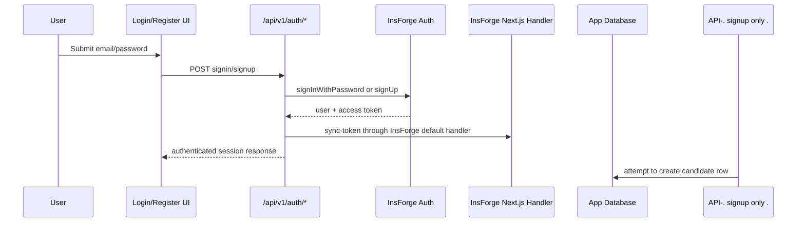

# Authentication

The intended active authentication system is InsForge, but legacy NextAuth code still exists. This creates a split-brain auth model that should be resolved before production hardening.

## Active InsForge Auth

Key files:

| File | Role |
| --- | --- |
| `src/lib/insforge.ts` | Browser/shared InsForge client using `NEXT_PUBLIC_INSFORGE_BASE_URL` and `NEXT_PUBLIC_INSFORGE_ANON_KEY`. |
| `src/lib/insforge-server.ts` | Server helper around `@insforge/nextjs/server` `auth()` and authenticated SDK client. |
| `src/middleware.ts` | InsForge page middleware for non-API routes. |
| `src/app/api/v1/auth/signin/route.ts` | Email/password signin via InsForge. |
| `src/app/api/v1/auth/signup/route.ts` | Email/password signup via InsForge plus attempted candidate creation. |
| `src/components/providers/InsforgeProvider.tsx` | React provider wrapper. |

## Legacy NextAuth

Legacy files:

| File | Role |
| --- | --- |
| `src/lib/auth.ts` | NextAuth options, Prisma adapter, CredentialsProvider, bcrypt password flow. |
| `src/app/api/auth/[...nextauth]/route.ts` | NextAuth GET/POST handler. |
| `src/app/api/auth/register/route.ts` | Public Prisma user registration with hashed password. |
| Prisma tables `Account`, `Session`, `VerificationToken` | NextAuth persistence tables. |

If InsForge is the backend identity provider, these should be removed after migration or clearly marked as legacy-only. Keeping both invites duplicate sessions, duplicate users, and inconsistent authorization behavior.

## Middleware Behavior

`src/middleware.ts`:

- Uses `InsforgeMiddleware`.
- Public routes include `/`, `/login`, `/register`, and `/api`.
- Matcher excludes `api`, Next static/image assets, favicon, and common image extensions.

This means page routes are protected by middleware, but API routes are not. API routes must enforce auth internally.

## Current Auth Flow

## Signup Provisioning Defect

`/api/v1/auth/signup` currently:

1. Creates an InsForge auth user.
2. Creates an authenticated InsForge SDK client with `edgeFunctionToken`.
3. Inserts into `candidates`.
4. Logs candidate creation failure but still continues.

Live database finding:

- `candidates` was not found.
- The canonical Prisma table is `Candidate`.

Impact:

- A user can sign up successfully while missing application profile records.
- Routes that depend on Prisma `User` or `Candidate` rows may return unauthorized or empty data.
- Candidate-specific features may use `user.id` as a fallback candidate id, which may not match Prisma IDs.

Recommended fix:

- After InsForge signup, call a provisioning service that upserts Prisma `User` and `Candidate`.
- Store the InsForge auth user id in the app database if not already present.
- Treat provisioning failure as a visible signup failure or a recoverable onboarding state, not a swallowed log.

## Role Model

`src/lib/auth-middleware.ts` reads:

- `user_metadata.role`, defaulting to `CANDIDATE`.
- `user_metadata.candidateId`, defaulting to `user.id`.

Roles supported in TypeScript:

- `CANDIDATE`
- `RECRUITER`
- `ADMIN`

Risks:

- Role data is metadata-driven and not clearly synchronized with Prisma `User.role`.
- `withRole` checks exact equality and has no hierarchy.
- Recruiter/admin route authorization should be tested explicitly.

Recommended target:

- Store canonical role in Prisma `User.role`.
- Sync or validate InsForge metadata from the database.
- Use permission helpers such as `canManageJobs`, `canViewCandidates`, and `canAdminister`, rather than raw role string equality everywhere.

## API Auth Patterns

| Pattern | Behavior | Risk |
| --- | --- | --- |
| `withAuth(req, handler)` | Adds `req.user` from InsForge session. | Candidate id fallback may not match Prisma candidate id. |
| `withAuth()` from `auth-helpers.ts` | Requires InsForge session and Prisma `User` by email. | Fails if signup did not provision Prisma user. |
| Direct `requireAuth()` | Returns authenticated InsForge client/user. | Route must handle generic errors consistently. |
| Public route | No auth. | Must be deliberate because middleware does not protect APIs. |
| NextAuth route | Separate session system. | Legacy split-brain auth. |

## Security Findings

| Finding | Severity | Action |
| --- | --- | --- |
| API routes are excluded from middleware. | High | Add route-level auth tests and route auth metadata. |
| Live RLS policies are empty. | Critical | Add RLS before direct SDK database access from browser or public clients. |
| Signup provisioning failure is swallowed. | Critical | Make provisioning required and observable. |
| NextAuth and InsForge coexist. | Critical | Choose one active auth system. |
| Role metadata is not strongly enforced. | High | Back roles with database state and permission helpers. |
| OAuth provider state/token storage needs review. | Medium | Verify CSRF state, redirect URI allowlist, encryption, and disconnect behavior. |

## Auth Recommendations

1. Declare InsForge as the only active auth system.
2. Remove or quarantine NextAuth routes and Prisma auth tables after migration.
3. Implement `provisionUserAfterSignup()` with a transaction.
4. Add `requireAppUser()` that returns InsForge user, Prisma user, candidate, and permissions together.
5. Add tests for unauthenticated, candidate, recruiter, and admin access to every protected API group.
6. Add RLS policies that match route-level authorization.

