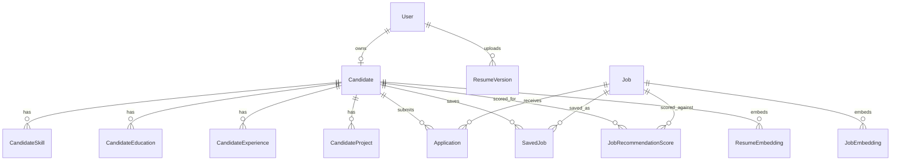
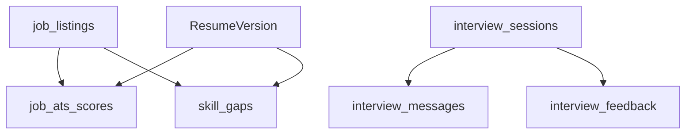

# Database

The project uses PostgreSQL on InsForge with Prisma ORM and direct InsForge SDK/PostgREST access. The live database contains both Prisma-style quoted CamelCase tables and snake-case feature tables.

## Live Backend Snapshot

Checked with InsForge CLI on April 29, 2026.

| Item | Value |
| --- | --- |
| Project | `smart-hire-v2` |
| Region | `ap-southeast` |
| Base URL | `https://2674danq.ap-southeast.insforge.app` |
| Tables | 69 |
| RLS policies | 0 |
| Triggers | 0 |
| Functions | 0 |
| InsForge CLI migrations | 0 listed |
| Prisma migrations table | Present as `_prisma_migrations` |

## Schema Groups

### Identity and Auth

| Table | Notes |
| --- | --- |
| `User` | Prisma application user table. Contains role, profile fields, alert/privacy preferences, and scores. |
| `Account` | NextAuth account table. Legacy if InsForge becomes the only auth system. |
| `Session` | NextAuth session table. Legacy if InsForge becomes the only auth system. |
| `VerificationToken` | NextAuth verification table. Legacy if InsForge becomes the only auth system. |

### Candidate and Profile

| Table | Notes |
| --- | --- |
| `Candidate` | Canonical candidate profile table in Prisma schema. |
| `CandidateProfile` | Extended structured profile data. |
| `CandidateEducation` | Education entries. |
| `CandidateExperience` | Experience entries. |
| `CandidateProject` | Project entries. |
| `CandidateSkill` | Skills and proficiency metadata. |
| `CandidateCertification` | Certifications. |
| `ProfilePrivacy` | Candidate privacy settings. |
| `ConnectedAccount` | Third-party linked account metadata. |

### Resume

| Table | Notes |
| --- | --- |
| `ResumeVersion` | Main Prisma resume version record. |
| `ResumeRaw` | Raw extracted text store, but current upload flows do not consistently populate it. |
| `ResumeEmbedding` | Resume embedding cache. |

### Jobs and Applications

| Table | Notes |
| --- | --- |
| `Job` | Prisma job table. |
| `Application` | Candidate applications. |
| `ApplicationNote` | Notes on applications. |
| `SavedJob` | Saved jobs. |
| `JobAlert` | Candidate job alerts. |
| `ApplicationEvent` / tracker-related tables | Application tracker history/analytics. |

### Recommendations and Behavior

| Table | Notes |
| --- | --- |
| `JobRecommendationScore` | Precomputed candidate-job scores. |
| `JobEmbedding` | Job description embedding cache. |
| `RecommendationBehaviorEvent` | User behavior signals. |
| `CandidateAnalytics` | Aggregated application analytics. |

### InsForge Feature Tables

| Table | Notes |
| --- | --- |
| `job_listings` | Public/job ATS listings. Live table has 25 rows. |
| `job_ats_scores` | Cached ATS scores. Live table has 8 rows. |
| `skill_gaps` | Skill gap history/cache. Live table has 12 rows. |
| `interview_sessions` | Mock interview sessions. Live table has 2 rows. |
| `interview_messages` | Interview messages. Live table has 2 rows. |
| `interview_feedback` | Feedback reports. Live table has 2 rows. |
| `interview_evaluations` | Per-answer analysis. |
| `question_bank` | Seeded interview questions. Live table has 10 rows. |

## Missing Tables Referenced By Code

The following tables are referenced by route handlers or services but were not found in the live database:

| Referenced Table | Referencing Code | Impact |
| --- | --- | --- |
| `profiles` | `src/app/api/profile/route.ts` | Legacy profile route is broken. |
| `resume_versions` | `src/app/api/resume/upload`, `src/app/api/resume/analyze`, `src/app/api/resume/[id]` | Legacy resume APIs are broken. |
| `resumes` | `src/services/resume/parser.service.ts`, `/api/v1/resumes/score/[jobId]`, `/api/v1/jobs/apply` | Legacy resume scoring/apply routes are broken. |
| `parsed_resumes` | `src/services/resume/*`, `/api/v1/career/path` | Career path and legacy resume services are broken. |
| `ats_scores` | `src/services/resume/scorer.service.ts` | Legacy ATS scorer is broken. |
| `resume_suggestions` | `src/app/api/resume/analyze`, `/api/resume/[id]/suggestions` | Legacy suggestion APIs are broken. |
| `candidates` | `/api/v1/auth/signup` | Signup provisioning fails to create the expected candidate row. |
| `jobs` | `/api/v1/jobs`, `/api/v1/jobs/search`, legacy resume optimizer services | Likely mismatch with Prisma quoted `Job`. |

## Simplified ER Diagram

## Live Feature Table Flow

## Indexes

The live database includes useful indexes such as:

- GIN indexes on Prisma array fields like `Job.requiredSkills` and `Candidate.skills`.
- Job listing filters for active/category queries.
- Composite indexes for `job_ats_scores` by candidate/listing.
- Composite indexes for `skill_gaps` by candidate/listing.
- Interview session/message indexes.
- Recommendation score indexes.

Indexes are not the current bottleneck. Data-model consistency and authorization are.

## RLS and Security

`npx -y @insforge/cli db policies --json` returned no policies.

This is critical because InsForge SDK/PostgREST access is policy-dependent if exposed outside trusted server routes. Until RLS exists:

- Do not rely on direct browser database access.
- Keep database access behind authenticated server route handlers.
- Add table-specific policies for user-owned rows.
- Add read-only policies for public job listings only if intended.

## Migration State

| Migration System | Current Finding |
| --- | --- |
| Prisma migrations | Local migration folders exist and `_prisma_migrations` exists in live DB. |
| InsForge CLI migrations | `db migrations list` returned no migrations. |
| Manual SQL docs | `docs/sql` exists. |

Recommendation: choose a primary migration system for schema evolution. If Prisma remains primary, InsForge CLI migrations should not be treated as the authoritative history.

## Database Recommendations

1. Create a checked-in schema manifest listing canonical tables and owners.
2. Rename/migrate legacy lower-case tables or delete references to absent tables.
3. Add RLS policies before allowing any browser-side SDK database access.
4. Make signup provisioning create `User`, `Candidate`, `ProfilePrivacy`, `NotificationPreference`, and related defaults.
5. Populate `ResumeRaw` consistently during upload/parse.
6. Add data integrity constraints where ownership is required, especially candidate-owned feature rows.
7. Add database contract tests to CI.

