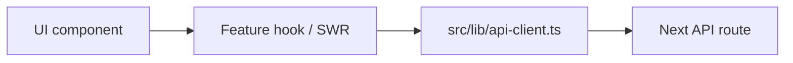

# Frontend

The frontend is a Next.js 16 App Router application using React 19 client/server components, Tailwind CSS, shadcn-style UI primitives, Framer Motion, Lucide icons, SWR, and Zustand.

## Route Groups

| Route Area | Path | Purpose |
| --- | --- | --- |
| Public | `/` | Landing page assembled from `src/components/sections/*`. |
| Auth | `/login`, `/register` | Candidate auth screens using InsForge-backed v1 auth APIs. |
| Dashboard | `/dashboard` | Main candidate dashboard with KPIs and summaries. |
| Resume | `/resume` | Resume upload, parse, score, and improvement workflow. |
| Jobs | `/jobs` | Search, recommended jobs, saved jobs, alerts, applications. |
| Job ATS | `/job-ats` | Job listing search and ATS fit analysis. |
| Skills | `/skills` | Skill gap analysis and learning resources. |
| Applications | `/applications` | Application tracker and analytics. |
| Interviews | `/interviews`, `/interviews/[id]`, `/interviews/[id]/feedback` | Mock interview setup, room, and feedback. |
| Profile | `/profile` | Candidate profile editor and privacy sections. |
| Integrations | `/integrations` | Third-party provider connection UI. |
| Roadmap | `/roadmap` | Career roadmap and milestones. |

## Component Organization

| Component Folder | Description |
| --- | --- |
| `applications` | Application tracker cards, analytics, timeline, forms, detail views. |
| `integrations` | Provider connection and status UI. |
| `interviews` | Setup card, chat/interview room, timer, feedback display, speech/TTS helpers. |
| `job-ats` | Job listing cards, score modals, drawers, skill/keyword analysis. |
| `jobs` | Search filters, recommendation feed, saved jobs, application actions. |
| `layout` | Dashboard shell and navigation. |
| `profile` | Profile section editors, avatar upload, privacy, connected accounts. |
| `providers` | InsForge React provider wrapper. |
| `resume` | Resume upload, score, parsed sections, improvement cards. |
| `sections` | Landing page content sections. |
| `skills` | Skill-gap tabs, resource drawer, role analysis, roadmap UI. |
| `ui` | Shared primitive components. |

## Providers and Styling

`src/app/layout.tsx` sets fonts, metadata, global CSS, the InsForge provider, and toast support.

`src/components/providers/InsforgeProvider.tsx` wraps `InsforgeBrowserProvider` with the client from `src/lib/insforge.ts`.

Styling currently uses Tailwind 4 packages and Tailwind 4-style CSS import. This conflicts with the repo instruction that requires Tailwind CSS 3.4 locked in `package.json`.

## Data Fetching

| Pattern | Examples | Notes |
| --- | --- | --- |
| Central API client | `src/lib/api-client.ts` | Intended to centralize frontend API calls. Not consistently used. |
| SWR hooks | `src/hooks/useProfileSections.ts`, `src/hooks/useResume.ts`, job/application hooks | Good fit for cache/revalidation but response shapes vary. |
| Zustand stores | `src/store/useResumeStore.ts`, `src/store/useSkillGapStore.ts`, `src/store/useJobATSStore.ts` | Stores include direct `fetch` calls, logs, and API shape adapters. |
| Direct component fetch | Some feature components | Increases duplication and makes auth/error behavior less predictable. |

Recommended target:

## State Management

| Store/Hook | Role | Audit Notes |
| --- | --- | --- |
| `useResumeStore` | Resume upload, parsed resume state, improvements, manual edits. | Directly calls legacy `/api/resume`, logs parsed projects, includes generated fix IDs. |
| `useSkillGapStore` | Skill gap analysis, roadmap updates, history. | Direct fetches, console debug logs, one explicit `any` lint error. |
| `useJobATSStore` | Job listing and ATS score state. | Direct fetches, error logs, uses v1 job listings/ATS endpoints. |
| `useProfileSections` | Profile section reads/mutations. | Own fetcher and response adapters. |
| `useInterviewTimer`, `useSpeechInput`, `useTTS` | Interview room UX. | Current lint flags synchronous state updates inside effects. |

## UX and Product Findings

| Area | Finding | Recommendation |
| --- | --- | --- |
| Dashboard | Some KPI/content values appear static or demo-like. | Replace with live API aggregates or label as placeholder during development. |
| Roadmap | Uses rich UI and some hardcoded/default target behavior. | Make target role explicit and persist roadmap generation state. |
| Resume | UI supports sophisticated flows, but backend route split can show inconsistent state. | Connect all resume UI to one canonical v1 pipeline. |
| Job ATS | Strong UI concept; depends on latest resume parse. | Show clear empty states when no parsed resume exists. |
| Interviews | Good interactive flow with timer/speech/TTS. | Add durable status states for feedback generation and failed AI calls. |
| Profile | Feature-complete but large. | Split page-level state and reduce rerender scope section by section. |

## Frontend Quality Findings

`npm run lint` currently fails. Frontend-specific issues include:

| Category | Examples |
| --- | --- |
| React hook rules | `integrations/page.tsx`, `ATSScoreModal.tsx`, `JobDetailDrawer.tsx`, `ResourceDrawer.tsx`, `useInterviewTimer.ts`, `useSpeechInput.ts`, `useTTS.ts`. |
| React purity | `ResumeSkillAnalysis.tsx` calls `Date.now()` during render. |
| Type safety | `TargetRoleResults.tsx` and `useSkillGapStore.ts` use explicit `any`. |
| Image optimization | Profile/avatar components use raw ``. |
| Dead imports | Multiple pages/components import unused icons/helpers. |
| Mojibake/comments | `profile/page.tsx` contains garbled separator text and a BOM at file start. |

## Performance Risks

| Risk | Why It Matters | Fix |
| --- | --- | --- |
| Large client components | Profile and skills pages hold broad state and many child sections. | Split into smaller memoized/server-assisted units. |
| Direct fetch duplication | Multiple hooks/stores do their own parsing and error handling. | Centralize request/response adapters. |
| AI request lifecycle | Some frontend actions may wait on slow AI route handlers. | Use job status and optimistic UI for long work. |
| Raw images | Avatar/profile images bypass Next image optimization. | Use `next/image` or InsForge storage URLs with configured loader. |
| Hook lint failures | Some effect patterns can cause cascaded renders. | Refactor effect-derived state into render values, callbacks, or event handlers. |

## Frontend Recommendations

1. Make `src/lib/api-client.ts` the only browser API transport, except upload endpoints that need `FormData`.
2. Define typed response contracts per endpoint and remove per-store shape guessing.
3. Fix all React lint errors before UI feature work continues.
4. Replace static dashboard/roadmap metrics with API data or visible development-only placeholders.
5. Remove PII-like console logging from stores and parser flows.
6. Align Tailwind with the repo instruction or update the instruction deliberately.

